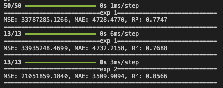
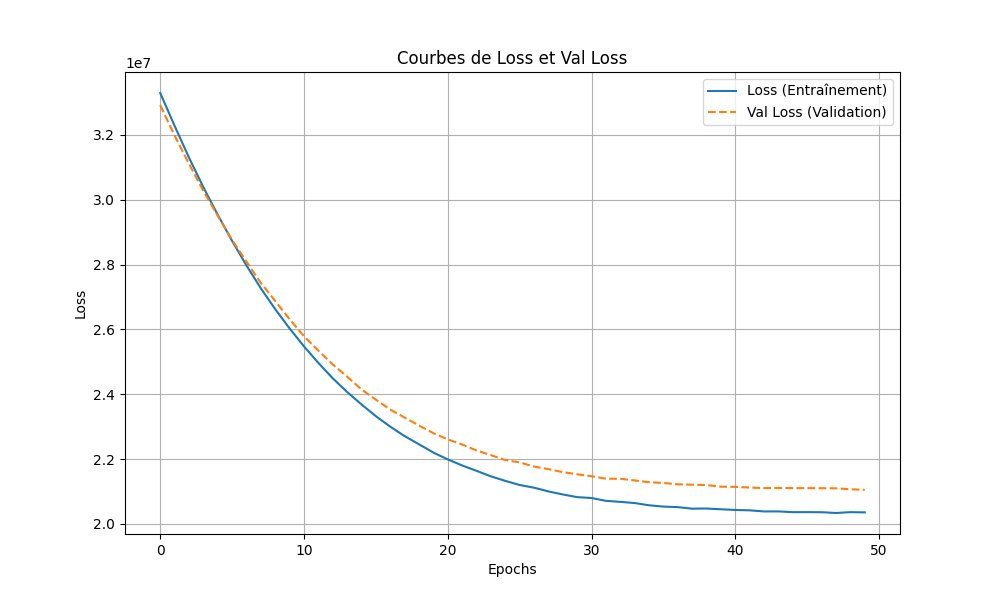

# Bienvenue dans ce projet d'IA

Installation :

    python -m venv .venv

Activation :

    source .venv/bin/activate

Installation des dépendances :

    pip install -r requirements.txt

## Résultats des évaluations

Le programme permet d'évaluer les performances d'un modèle qui prédit le montant d'un prêt à partir des caractéristiques socio-démographiques d'un individu.

Le programme effectue 3 évaluations successives :

1. La première évaluation utilise les données d'entraînement
2. La deuxième évaluation utilise un jeu de données de test
3. La troisième évaluation utilise une version du modèle ré-entraînée plus longuement, évaluée sur les données de test.

Pour chaque évaluation, le programme nous donne l'erreur quadratique moyenne (MSE), l'erreur absolue moyenne (MAE), et le coefficient de détermination (R2).

La MSE et la MAE nous permettent de quantifier les erreurs réalisées par le modèle. Ainsi, plus le modèle est correct, et plus ces métriques sont basses.

Le coefficient de détermination, quant à lui, nous donne une appréciation intelligible de la qualité du modèle : il est assimilable à un score où 1 équivaut à un modèle parfait.
Plus le modèle est correct, plus le coefficient de détermination sera proche de 1.

### Métriques

Nous pouvons constater grâce aux erreurs absolues moyennes et aux coefficients de détermination de chaque évaluation qu'en temps normal, le modèle est plus performant sur ses données d'entraînement que sur les données de test.
En revanche, en l'entraînant plus longuement, nous pouvons voir qu'il devient plus performant sur les données de test qu'il ne l'était sur les données d'entraînement.

### Courbes

Le programme nous affiche également un graphique lié à l'entraînement du modèle lors de la troisième évaluation.

Ce graphique représente l'évolution de la valeur de _loss_, c'est-à-dire une quantification des erreurs de prédiction du modèle (ici l'erreur quadratique moyenne) en fonction du nombre d'epochs (c'est-à-dire une revue complète du dataser d'entraînement).

Nous pouvons voir que la loss diminue drastiquement au cours de l'entraînement, passant de $3.1 * 10^7$ (0 epochs) à moins de $2.1 * 10^7$ (49 epochs)

Nous pouvons également remarquer que la valeur de loss lors de la validation (prédiction sur les données de test) est généralement plus élevée que celle de l'entraînement (prédiction sur les données d'entraînement)

## Le modèle d'IA

Nous avons ici un réseau de neurones (NN) avec :
2 couches "denses"
1 couche de prédiction

### Architecture du projet

    .
    ├── data/
    │   ├── df_new.csv
    │   └── df_old.csv
    ├── models/
    │   ├── models.py
    │   ├── model_2024_08.pkl
    │   └── preprocessor.pkl
    ├── modules/
    │   ├── evaluate.py
    │   ├── preprocess.py
    │   └── print_draw.py
    ├── .gitignore
    ├── README.md
    ├── main.py
    └── requirements.txt

data/

C'est là que sont stockées les données.

    df_new.csv : Les données fraîches du jour, prêtes à être dévorées par notre IA.
    df_old.csv : Les anciennes données ayant servis à l'apprentissage initial du modèle

models/

C'est là que sont stockés les modèles

    models.py : C'est ici que l'on définit l'architecture de notre NN.
    model_2024_08.pkl : Une version sauvegardée de notre modèle.
    preprocessor.pkl : le preparateur de données

modules/

C'est là que le code python se découpe en modules ayant chaque une tâche définie

    evaluate.py : Module d'évaluation du modèle.
    preprocess.py : Module de préparation des données
    print_draw.py : Module d'affichage des résultats
